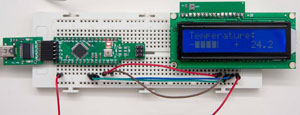

# LiquidCrystal

## Introduction ##

Welcome to the *LCD Library* for **Arduino** and **Chipkit**. It is a derivate of the original LiquidCrystal Library as sourced in the Arduino SDK. It has been developed to be compatible with the current LiquidCrystal library, 
its performance is almost 5 times faster and fully extendable if need be. 

It supports most ``Hitachi HD44780`` based LCDs, or compatible, connected to any project using: 4, 8 
wire parallel interface, I2C IO port expander (native I2C and bit bang) and Shift Regiter.

It currently supports 4 types of connections:

* 4 bit parallel LCD interface
* 8 bit parallel LCD interface
* I2C IO bus expansion board with the PCF8574* I2C IO expander ASIC such as [I2C LCD extra IO](http://www.electrofunltd.com/2011/10/i2c-lcd-extra-io.html "I2C LCD extra IO").
* ShiftRegister adaptor board as described [Shift Register project home](http://code.google.com/p/arduinoshiftreglcd/ "Shift Register project home") or in the HW configuration described below, 2 and 3 wire configurations supported.
* ShiftRegister 3 wire latch adaptor board as described [ShiftRegister 3 Wire Home](http://www.arduino.cc/playground/Code/LCD3wires "ShiftRegister 3 Wire Home")
* Support for 1 wire shift register [ShiftRegister 1 Wire](http://www.romanblack.com/shift1.htm "ShiftRegister 1 Wire")
* I2C bus expansion using general purpose IO lines.

### How do I get set up? ###

* Please refer to the project's [wiki](https://bitbucket.org/fmalpartida/new-liquidcrystal/wiki/Home "wiki")

### Contributors
The library has had the invaluable contribution of:

* [piccaso](http://www.3guys1laser.com/blog-cheap-arduino-2-wire-lcd-display-0 "picas") - Florian Fida - Flo, thanks for testing and improving the SR library, initial version of the 1 wire interface and speed improvements.
* B. Perry - *bperrybap@opensource.billsworld.billandterrie.com*, with his thoughtful contribution, speed improvements and development support for the SR2W library.
* Adrian Piccioli, with his contribution to the i2c GPIO support.
* [todbot](https://github.com/todbot "todbot") Tod E. Kurt for the [softwarei2cmaster](https://github.com/todbot/SoftI2CMaster "softwarei2cmaster") library.
* [felias-fogg](https://github.com/felias-fogg) - Bernhard for the [softwarei2cmaster fast](https://github.com/felias-fogg/SoftI2CMaster "softwirei2cmaster")

#### Contribution guidelines

* Writing tests
* Code review
* Help out with bug fixing
* Setup a project logo
* Write new drivers to support more LCDs.

### Who do I talk to? ###

* Repo owner or admin
* For SoftI2CMaster latest versions, updates and support, please refer to [SoftI2CMaster](https://github.com/todbot/SoftI2CMaster "todbot")
