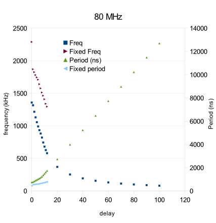
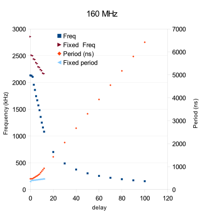

Software SPI
===========

Software SPI is likely to be of use only for ESP8266, but is enabled for all architectures.

The ESP8266 can manage a minimum of about 70ns between bit edges, with a maximum of
about 1.8 MBit/s at normal CPU clock frequency or 2.5 MHz if CPU clock set to fast.

Configuration Variables
-----------------------

.. envvar:: SPISOFT_DELAY_VARIABLE

   default: 0 (disabled)

   This setting must be enabled in order to use :cpp:func:`SPISoft::setDelay`.
   The base clock speed (i.e. delay=0) is reduced to about 1.4 MBit/s (2.1 MBit/s for fast CPU).

   The appropriate delay factor can be provided in the :cpp:class:`SPISoft` constructor,
   or by calling :cpp:func:`SPISoft::setDelay`.

   With the ESP8266, then the appropriate delay factor is calculated automatically from
   the speed passed in :cpp:class:`SPISettings`.
   This will override any previously set delay factor.
   Use a speed of 0 to use the manually configured delay value.

.. envvar:: SPISOFT_DELAY_FIXED

   default: 0 (disabled)
   maximum: 10

   Adds the requested number of 'NOP' CPU instructions to every clock transition.

   Has less impact than enabling variable delays.

   Use variable delays if 10 is insufficient.

   Will be ignored if variable delays are enabled.

Performance
-----------

The following information has been obtained by measurement.
The test application was built using:

.. code-block:: bash

   make SPISOFT_CALIBRATE=1 SPISOFT_DELAY_VARIABLE=1 CPU_FAST=0

then flashed to an ESP-12F. An oscilliscope was hooked up to the SCK output
and the maximum frequency at each delay setting noted.
(Not too awkward, just note down the frequency each time the figure changes.)

Entering these into the `spisoft.ods` spreadsheet allows the values to be charted and
co-efficients calculated.

Curiously values from 8 upward form a straight line so we can calculate those.
Smaller values are non-linear so a small lookup table is used.

Repeat for `CPU_FAST=1`.

Note that these figures are concerned with *maximum* (i.e. burst) frequencies
at each delay setting, since that is what devices are sensitive to.

80 MHz CPU
~~~~~~~~~~

=======  ==========  =======
.        Frequency (kHz)
-------  -------------------
Delay    Variable    Fixed
=======  ==========  =======
0        1357        2288
1        1315        1869
2        1215        1824
3        1129        1780
4        1055        1744
5        990         1709
6        932         1639
7        881         1575
8        819         1511
9        743         1462
10       680         1408
11       626         1338
12       578         1294
20       367
30       251
40       192
50       155
60       129
70       112
80       98
90       87
100      79
=======  ==========  =======

160 MHz CPU
~~~~~~~~~~~

=======  ==========  =======
.        Frequency (kHz)
-------  -------------------
Delay    Variable    Fixed
=======  ==========  =======
0        2133        2857
1        2126        2510
2        2106        2500
3        1958        2439
4        1861        2429
5        1745        2372
6        1668        2353
7        1573        2294
8        1482        2283
9        1357        2242
10       1250        2222
11       1160        2174
12       1081        2165
20       702
30       488
40       374
50       303
60       255
70       220
80       193
90       172
100      156
=======  ==========  =======

API Documentation
-----------------

.. doxygengroup:: soft_spi
   :content-only:
   :members:

