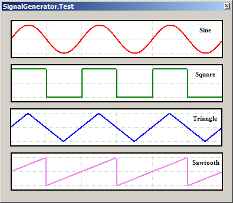
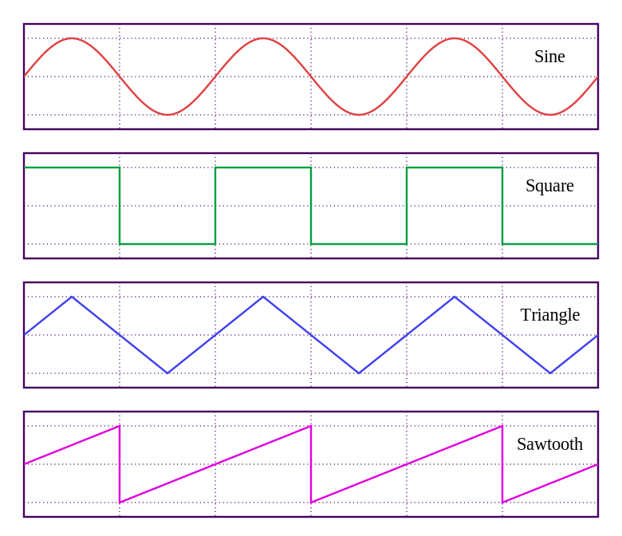

Signal Generator
================

This Component provides the SignalGenerator class which can be used to synthesise a wide range of analogue signals.

Ported from https://www.codeproject.com/Articles/30180/Simple-Signal-Generator

.. highlight:: c++

Simple Signal Generator
-----------------------
   
29 Oct 2008 `CPOL <http://www.codeproject.com/info/cpol10.aspx>`__.
Tefik Becirovic

Useful software equivalent for a real, simple signal generator device

Introduction
~~~~~~~~~~~~

The Simple Signal Generator is a C# class designed to generate four simple periodic waveforms including sine, square, triangle, and sawtooth.
The class is provided for testing software and hardware components during the development of measurement applications.
A generated signal varies across time domains, and by default, is normalized by the amplitude A € [-1,1] and period T € [0,1].
It is possible to set an arbitrary amplitude, frequency, DC-offset, and phase shift, and to invert the signal.

Background Display
~~~~~~~~~~~~~~~~~~

There are a couple of articles on The Code Project that describe in detail about developing different user defined components for dynamically
changing single values or signal shapes such as bars, graphs, charts, gauges, and a diversity of other instruments.

For testing those components, functions like y=F(x) are very often used. These functions are typically periodical, mostly sine,
and their variable x will be modified in a loop with constant steps across an interval [x0,xn].

Hardware developers use a totally different technique. For analyzing and troubleshooting electronic systems, they use an additional
external device called signal or function or waveform generator. The signal generator is an important piece of electronic test equipment,
and should not be missed in any electronics laboratory.

On the device, we can select a built-in periodical function like y=F(t); the variable t represents real time, and we can change some
parameters like frequency, amplitude, and the DC-offset. Typically, there are four basic signal types.

After customization, the desired output signal can be wired on to the input of the component that should be tested, and we monitor
their response function in the time domain using an oscilloscope.

Displayed here is a typical low-cost signal generator that has on its front panel, a radio-button with four positions to choose
signal types and three potentiometers to adjust frequency, amplitude, and DC-offset. It is no big problem for hardware dudes to
make something such as this, especially with tips from the book [1]_.

Of course, there are much better and more expensive devices on the market with more functions, more parameters to choose,
better range and a finer scale for these parameters, integrated display to show selected settings, user-defined functions,
on-board memory, better stability, and two or more independent channels.

Note that, there are two very significant differences between the hardware and the software approach. Hardware developers use
an external device, and a test signal is in the time domain, which implies that the test signal varies totally independent
from the assembly that will be tested.`

The class presented offers a software equivalent for the above described real, simple signal generator device.

Using the Code
~~~~~~~~~~~~~~

For using the class, we have a public function in the form y=F(t). The parameter t is the real time here::

   float GetValue();

After a lot of consideration, I added another overload of the function in the form y=F(x). The Parameter x is explicitly given as a time here::

   float GetValue(float time);

This should be used publicly only for DEBUG purposes, eventually during tests by adding new signal types!

All signals have a normalized period T € [0,1] in cycles, and not the usual T € [0,2Pi] in radian. In this case, a value 1 corresponds to
a full cycle. The basis for this is an easier deal with normalized values, for example, for scaling operations by fitting in a window.

The signal generator is given as a class, but it is quite easy to transform it to a non-visual, or yet to a visual component,
or maybe to a form like a front panel.

For generating all the given signals, very simple functions are used, but they are not the simplest. Some functions can be made simpler,
but a development goal of this project was to generate signals exactly like the following example on
`Wikipedia <https://commons.wikimedia.org/w/index.php?curid=343520>`__:

   Sine, square, triangle, and sawtooth waveforms
   By Omegatron - Own work, CC BY-SA 3.0

.. [1] Delton T. Horn, Build Your Own Low-Cost Signal Generator, McGraw-Hill/TAB Electronics, 1994, ISBN 0070304289
.. [2] R.A. Penfold, How to Use Oscilloscopes and Other Test Equipment, Bernard Babani Publishing, 1989, ISBN 0859342123
.. [3] `Introduction to the Function Generator <http://www.ee.usyd.edu.au/tutorials_online/labintro/wav.html>`__
.. [4] `Using a Basic Function Generator <http://cnx.org/content/m11895/latest/>`__
