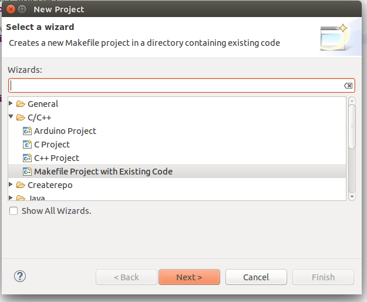
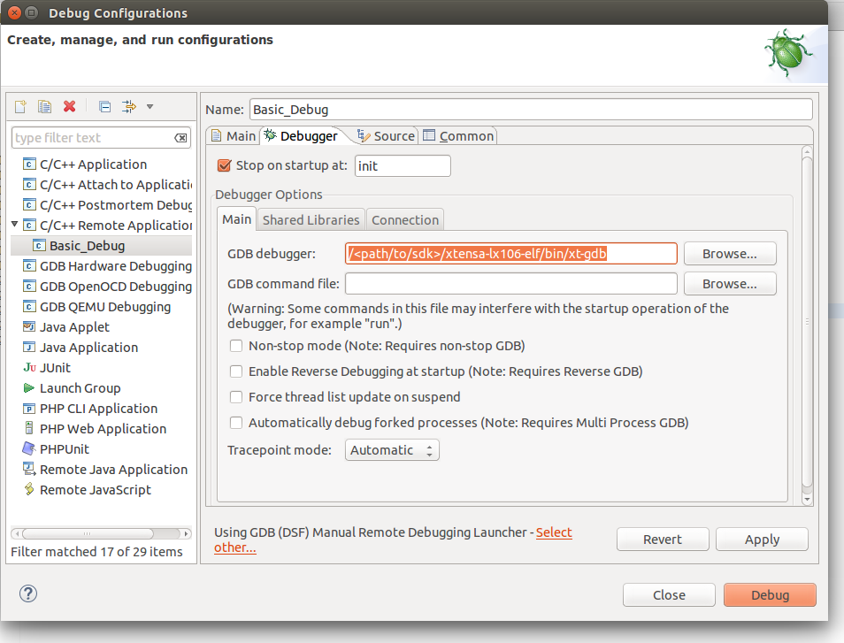
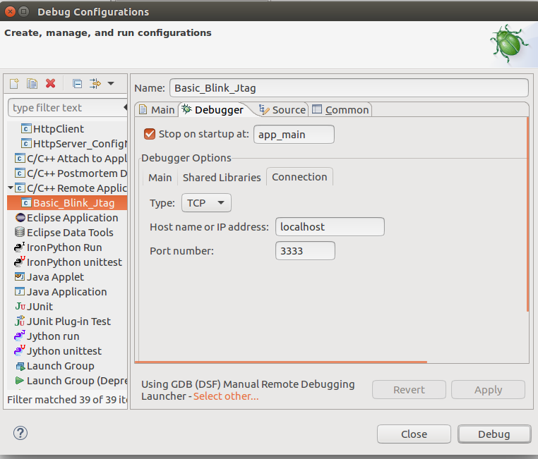
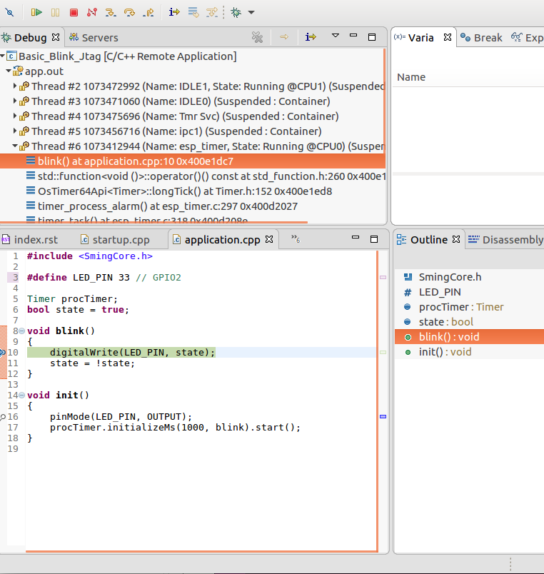

Debugging on ESP32
==================

Required tools and hardware
---------------------------
A debugger and a JTAG hardware are required.
The debugger is part of the provided toolchain.
Make sure that you have the following executable in your PATH::

    xtensa-esp32-elf-gdb

Debugging with JTAG is explained in details in the `ESP-IDF documentation <https://docs.espressif.com/projects/esp-idf/en/v4.0.1/api-guides/jtag-debugging/index.html>`__.
Make sure to read it carefully.

For the purposes of this documentation we will be using `ESP-Prog JTAG adapter <https://github.com/espressif/esp-iot-solution/blob/master/documents/evaluation_boards/ESP-Prog_guide_en.md>`__
and ESP32-Cam microcontroller from AI-Thinker.

Configure Hardware
------------------
The JTAG adapter has to be connected to your ESP32 microcontroller.
The following pins from the JTAG adapter have to be connected to ESP32 for the communication to work.

    +---+---------------+-------------+
    |   | ESP32 Pin     | JTAG Signal |
    +===+===============+=============+
    | 1 | VCC           | VCC         |
    +---+---------------+-------------+
    | 2 | MTDO / GPIO15 | TDO         |
    +---+---------------+-------------+
    | 3 | MTDI / GPIO12 | TDI         |
    +---+---------------+-------------+
    | 4 | MTCK / GPIO13 | TCK         |
    +---+---------------+-------------+
    | 5 | MTMS / GPIO14 | TMS         |
    +---+---------------+-------------+
    | 6 | GND           | GND         |
    +---+---------------+-------------+

Running OpenOCD
---------------
Once the JTAG adapter is connected to the microcontroller and to a computer we have to start the OpenOCD server that will communicate with the JTAG adapter.
For our specific hardware the following command has to be executed::

    openocd -f interface/ftdi/esp32_devkitj_v1.cfg -f board/esp-wroom-32.cfg

If you have configured your JTAG adapter correctly the following messages should show up::

    Open On-Chip Debugger  v0.10.0-esp32-20190313 (2019-03-13-09:52)
    Licensed under GNU GPL v2
    For bug reports, read
        http://openocd.org/doc/doxygen/bugs.html
    none separate
    adapter speed: 20000 kHz
    Info : Configured 2 cores
    esp32 interrupt mask on
    Info : Listening on port 6666 for tcl connections
    Info : Listening on port 4444 for telnet connections
    Info : ftdi: if you experience problems at higher adapter clocks, try the command "ftdi_tdo_sample_edge falling"
    Info : clock speed 20000 kHz
    Info : JTAG tap: esp32.cpu0 tap/device found: 0x120034e5 (mfg: 0x272 (Tensilica), part: 0x2003, ver: 0x1)
    Info : JTAG tap: esp32.cpu1 tap/device found: 0x120034e5 (mfg: 0x272 (Tensilica), part: 0x2003, ver: 0x1)
    Info : esp32: Debug controller 0 was reset (pwrstat=0x5F, after clear 0x0F).
    Info : esp32: Core 0 was reset (pwrstat=0x5F, after clear 0x0F).
    Info : esp32: Debug controller 1 was reset (pwrstat=0x5F, after clear 0x0F).
    Info : esp32: Core 1 was reset (pwrstat=0x5F, after clear 0x0F).
    Info : Detected debug stubs @ 3ffb42ac on core0 of target 'esp32'
    Info : Listening on port 3333 for gdb connections
    Info : accepting 'gdb' connection on tcp/3333

Recompilation is required
-------------------------

In order to debug applications based on Sming Framework make sure that
you are using Sming version 3.8.0 or newer.

Compilation directives
~~~~~~~~~~~~~~~~~~~~~~

If you want to debug your application and the Sming Framework code make sure to
(re)compile it with :envvar:`ENABLE_GDB` =1 directive::

   cd $SMING_HOME/../samples/Basic_Blink
   make dist-clean
   make ENABLE_GDB=1

The commands above will re-compile Sming with debug symbols and
optimizations for debugging. These commands need to be executed once.

Application
~~~~~~~~~~~

To use, (re)compile your application with the ENABLE_GDB option and
flash it to the board. For this example we will use the :sample:`Basic_Blink`
sample application::

   cd $SMING_HOME/../samples/Basic_Blink
   make clean
   make ENABLE_GDB=1 # -- recompiles your application with debugging support
   make flashapp # flashes ONLY the (re)compiled application

The device will restart then wait for a debugger to be connected. Before starting the debugger you
must be sure that the OpenOCD server is running and listening for incoming connections on localhost port 3333.
Now start the debugger with the command below
::

   make gdb

This will start a new debugging session. The debugger will try to connect to OpenOCD server and in the OpenOCD logs you should see a
message similar to the one below::

    Info : accepting 'gdb' connection on tcp/3333
    Info : Target halted. PRO_CPU: PC=0x4012F7EE (active)    APP_CPU: PC=0x4012F7EE
    Info : Target halted. PRO_CPU: PC=0x4009171A (active)    APP_CPU: PC=0x4012F7EE
    Info : Flash mapping 0: 0x10020 -> 0x3f400020, 89 KB
    Info : Flash mapping 1: 0x30018 -> 0x400d0018, 388 KB
    Info : Target halted. PRO_CPU: PC=0x4009171A (active)    APP_CPU: PC=0x4012F7EE
    Info : Auto-detected flash size 4096 KB
    Info : Using flash size 4096 KB

And in the GDB console you will see a message similar to this one::

    Reading symbols from out/Esp32/debug/build/app.out...done.
    0x4012f7ee in is_wifi_clk_peripheral (periph=PERIPH_LEDC_MODULE)
        at /x/esp-idf/components/driver/periph_ctrl.c:225
    225     switch(periph) {
    JTAG tap: esp32.cpu0 tap/device found: 0x120034e5 (mfg: 0x272 (Tensilica), part: 0x2003, ver: 0x1)
    JTAG tap: esp32.cpu1 tap/device found: 0x120034e5 (mfg: 0x272 (Tensilica), part: 0x2003, ver: 0x1)
    esp32: Debug controller 0 was reset (pwrstat=0x5F, after clear 0x0F).
    esp32: Core 0 was reset (pwrstat=0x5F, after clear 0x0F).
    esp32: Debug controller 1 was reset (pwrstat=0x5F, after clear 0x5F).
    esp32: Core 1 was reset (pwrstat=0x5F, after clear 0x5F).
    Target halted. PRO_CPU: PC=0x5000004B (active)    APP_CPU: PC=0x00000000
    esp32: Core 0 was reset (pwrstat=0x1F, after clear 0x0F).
    Target halted. PRO_CPU: PC=0x40000400 (active)    APP_CPU: PC=0x40000400
    Hardware assisted breakpoint 1 at 0x400e1cd3: file /x/Sming/Sming/Arch/Esp32/Components/esp32/startup.cpp, line 21.
    (gdb)

If the debugger is exited, the application will continue execution as normal.
Re-connecting the debugger will pause execution.

GDB commands
------------

There are multiple commands supported in GDB and we will mention only some of them.

List current source code
~~~~~~~~~~~~~~~~~~~~~~~~

One possibility is to see the source code of the current line where the
execution has stopped. To achieve this you should type ``list`` in the gdb
console::

    (gdb) list
    220
    221 static bool is_wifi_clk_peripheral(periph_module_t periph)
    222 {
    223     /* A small subset of peripherals use WIFI_CLK_EN_REG and
    224        CORE_RST_EN_REG for their clock & reset registers */
    225     switch(periph) {
    226     case PERIPH_SDMMC_MODULE:
    227     case PERIPH_SDIO_SLAVE_MODULE:
    228     case PERIPH_EMAC_MODULE:
    229     case PERIPH_RNG_MODULE:
    (gdb)

Break the execution
~~~~~~~~~~~~~~~~~~~

This command will pause the debugger once it reaches a specific function
or line in the code. This is called ``breakpoint`` and can be set like this::

   (gdb) break blink
   Breakpoint 2 at 0x400e1dc4: file app/application.cpp, line 9.

Continue the execution
~~~~~~~~~~~~~~~~~~~~~~

To continue the execution of the application we can use the ``continue``
command::

   (gdb) continue
   Continuing.
   Target halted. PRO_CPU: PC=0x400E1DC4 (active)    APP_CPU: PC=0x4012F7EE
   [New Thread 1073483724]
   [New Thread 1073514968]
   [New Thread 1073494600]
   [New Thread 1073487892]
   [Switching to Thread 1073412944]

   Breakpoint 1, blink () at app/application.cpp:9
   9 {
   (gdb)

Because we have set already a breakpoint for the ``blink`` function the
execution will be paused when the ``blink`` function is reached and from
here you can go to the next line or see the current values of the
variables.

Go to the next line
~~~~~~~~~~~~~~~~~~~

This can be done using ``next``::

   (gdb) next
   10      digitalWrite(LED_PIN, state);

See variable value
~~~~~~~~~~~~~~~~~~

The command to see a value is ``print`` followed by the name of the
value. For example to see the value of the ``ledState`` variable inside
the ``blink`` function we could type::

   (gdb) print state
   $1 = true

You can see more useful commands :ref:`here <useful-gdb-commands>`.

Or watch the following short video

.. image:: https://img.youtube.com/vi/hVwSX_7Ey8c/3.jpg
   :target: https://www.youtube.com/watch?v=hVwSX_7Ey8c

Debugging with visual debuggers like Eclipse CDT
------------------------------------------------

A good visualization helps us understand things faster. What we can do
is use `Eclipse CDT <https://eclipse.org/cdt/downloads.php>`__ and its
debugging plugins to do remote debugging as we did from the command
line.

Here is how this can be done:

- Start Eclipse CDT and import the :sample:`Basic_Blink` sample:

  - Select *File* -> *New* -> *Project* -> *C/C++* -> *Makefile Project with Existing Code*
  - Point Eclipse to the location of the Basic_Blink sample
  - Import the Sming Framework (if you haven’t done it yet)

   Import Project

Once the two projects are in Eclipse, set the *Basic_Blink* project to
reference the *Sming* project.

Now create a new *Remote Debugging* Configuration:

- Select *Run* -> *Debug Configurations* -> *C/C++ Remote Application*
- Right-click and create a new *C/C++ Remote Application*
- In the *Main* tab set, set:

  - *Project*: *Basic_Build*
  - *C/C++ Application*: *out/build/Esp8266/Debug/app.out*
  - disable for now the *auto* build

.. figure:: debugging-2.png
   :alt: Remote Debugging Session

   Remote Debugging Session

Then go to the Debugger tab and point the GDB debugger to your
Xtensa-gdb binary. (Type ``make list-config`` and look for :envvar:`GDB`.)

   Remote Debugging Session

Make sure to load also *GDB command file*. The file is called ``gdbinit``, and you may wish to place
a copy of the file somewhere else, especially if you intend to modify it.
You can see the file here :source:`Sming/Arch/Esp32/Tools/gdbinit`.

Finally we should configure the remote connection. Go to the
*Debugger* -> *Connection* tab and set:

- type: *TCP*
- host: localhost
- port: 3333

   Set remote connection

We are now ready for debugging. Press the *Debug* button. (In the
screenshot above the Debug button is in the bottom-right corner.) After
some seconds your debugging session should be up and running and you can
enjoy live debugging.

   Live Debugging Session

You will be able to see the current variables and their values. You
should be able to go step by step, go inside of functions, add
breakpoints to code in RAM or add breakpoints to code that was in FLASH.