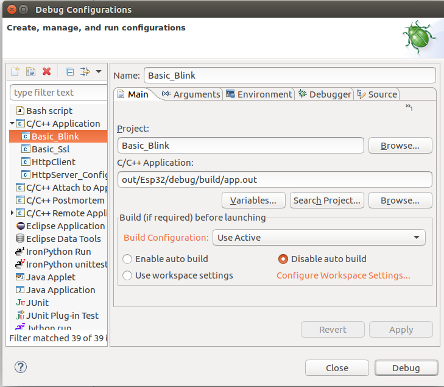
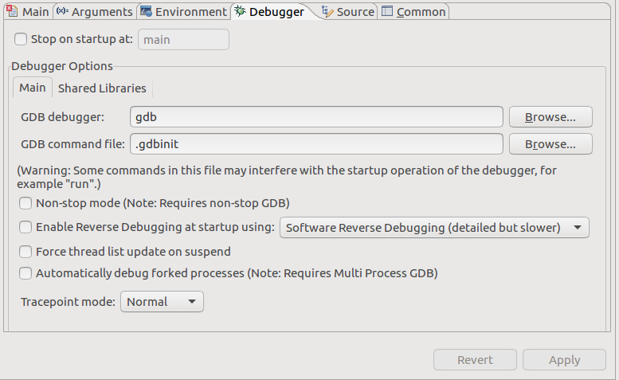

Debugging on Host
====================

Required tools and hardware
---------------------------
A GNU C/C++ debugger is the only requirement for the Host architecture.
Make sure that you have the following executable in your PATH::

    gdb

No additional hardware is required.

Recompilation is required
-------------------------

In order to debug applications based on Sming Framework make sure that
you are using Sming version 3.8.0 or newer.

Compilation directives
~~~~~~~~~~~~~~~~~~~~~~

If you want to debug your application and the Sming Framework code make sure to
(re)compile it with :envvar:`ENABLE_GDB` =1 directive::

   cd $SMING_HOME/../samples/LiveDebug
   make dist-clean
   make ENABLE_GDB=1

The commands above will re-compile Sming with debug symbols and
optimizations for debugging. These commands need to be executed once.

You can recompile Sming with the following directives to debug better Sming and the LWIP TCP/IP stack ::

   cd $SMING_HOME/../samples/LiveDebug
   make Sming-build all ENABLE_GDB=1 ENABLE_LWIPDEBUG=1

Application
~~~~~~~~~~~

To use, (re)compile your application with the ENABLE_GDB option and
flash it to the board. For this example we will use the :sample:`LiveDebug`
sample application::

   cd $SMING_HOME/../samples/LiveDebug
   make clean
   make ENABLE_GDB=1 # -- recompiles your application with debugging support

The next step is to start the debugger. This can be done with the command below::

   make gdb

After that a new interactive debugging session will be started::

   Welcome to SMING!
   Type 'r' to run application

To start the execution of the application type `r` or `run`::

   (gdb) r
   Starting program: /x/Sming/samples/LiveDebug/out/Host/debug/firmware/app --flashfile=out/Host/debug/firmware/flash.bin --flashsize=4M --pause
   [Thread debugging using libthread_db enabled]
   Using host libthread_db library "/lib/i386-linux-gnu/libthread_db.so.1".
   [New Thread 0xf7bdcb40 (LWP 16428)]

   Welcome to the Sming Host emulator

   host_flashmem_init: Created blank "out/Host/debug/firmware/flash.bin", 4194304 bytes

   ...
   main: >> Starting Sming <<

You can pause the program execution by pressing `Ctrl-C`.  And work further using some further GDB commands. The next paragraph describes some of them.

GDB commands
------------

There are multiple commands supported in GDB and we will mention only some of them.

List current source code
~~~~~~~~~~~~~~~~~~~~~~~~

One possibility is to see the source code of the current line where the
execution has stopped. To achieve this you should type ``list`` in the gdb
console::

    (gdb) list
    102     }
    103 }
    104
    105 int main(int argc, char* argv[])
    106 {
    107     trap_exceptions();
    108
    109     host_printf("\nWelcome to the Sming Host emulator\n\n");
    110
    111     static struct {

Break the execution
~~~~~~~~~~~~~~~~~~~

This command will pause the debugger once it reaches a specific function
or line in the code. This is called ``breakpoint`` and can be set like this::

   (gdb) break blink
   Breakpoint 1 at 0x40105d4c: file app/application.cpp, line 66.

Continue the execution
~~~~~~~~~~~~~~~~~~~~~~

To continue the execution of the application we can use the ``continue``
command::

   (gdb) continue
   Continuing.

   Breakpoint 1, blink () at app/application.cpp:66
   66 {
   (gdb)

Because we have set already a breakpoint for the ``blink`` function the
execution will be paused when the ``blink`` function is reached and from
here you can go to the next line or see the current values of the
variables.

Go to the next line
~~~~~~~~~~~~~~~~~~~

This can be done using ``next``::

   (gdb) next
   67      digitalWrite(LED_PIN, ledState);

See variable value
~~~~~~~~~~~~~~~~~~

The command to see a value is ``print`` followed by the name of the
value. For example to see the value of the ``ledState`` variable inside
the ``blink`` function we could type::

   (gdb) print ledState
   $1 = true

You can see more useful commands :ref:`here <useful-gdb-commands>`.

Or watch the following short video

.. image:: https://img.youtube.com/vi/hVwSX_7Ey8c/3.jpg
   :target: https://www.youtube.com/watch?v=hVwSX_7Ey8c

Debugging with visual debuggers like Eclipse CDT
------------------------------------------------

A good visualization helps us understand things faster. What we can do
is use `Eclipse CDT <https://eclipse.org/cdt/downloads.php>`__ and its
debugging plugins to do remote debugging as we did from the command
line.

Here is how this can be done:

- Start Eclipse CDT and import the :sample:`LiveDebug` sample:

  - Select *File* -> *New* -> *Project* -> *C/C++* -> *Makefile Project with Existing Code*
  - Point Eclipse to the location of the LiveDebug sample
  - Import the Sming Framework (if you haven’t done it yet)

.. figure:: debugging-1.png
   :alt: Import Project

   Import Project

Once the two projects are in Eclipse, set the *LiveDebug* project to
reference the *Sming* project.

Now create a new *Debugging* Configuration:

- Select *Run* -> *Debug Configurations* -> *C/C++ Application*
- Right-click and create a new *C/C++ Application*
- In the *Main* tab set, set:

  - *Project*: *Basic_Build*
  - *C/C++ Application*: *out/Host/debug/firmware/app*
  - disable for now the *auto* build

   C/C++ Application

Then go to the Debugger tab and point the GDB debugger to your
gdb binary. (Type ``make list-config`` and look for :envvar:`GDB`.)

   Debugger configuration

We are now ready for debugging. Press the *Debug* button. (In the
screenshot above the Debug button is in the bottom-right corner.) After
some seconds your debugging session should be up and running and you can
enjoy live debugging.

.. figure:: eclipse.png
   :alt: Live Debugging Session

   Live Debugging Session

You will be able to see the current variables and their values. You
should be able to go step by step, go inside of functions, add
add breakpoints and watchpoints.