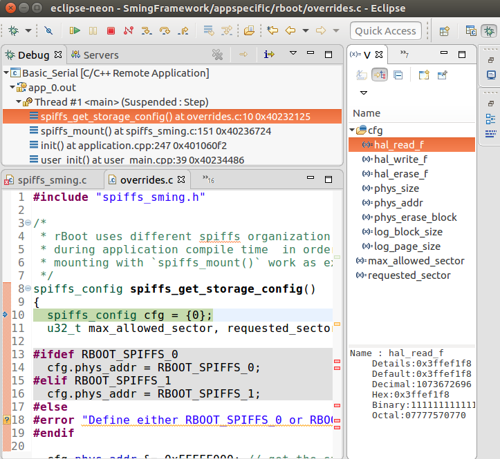
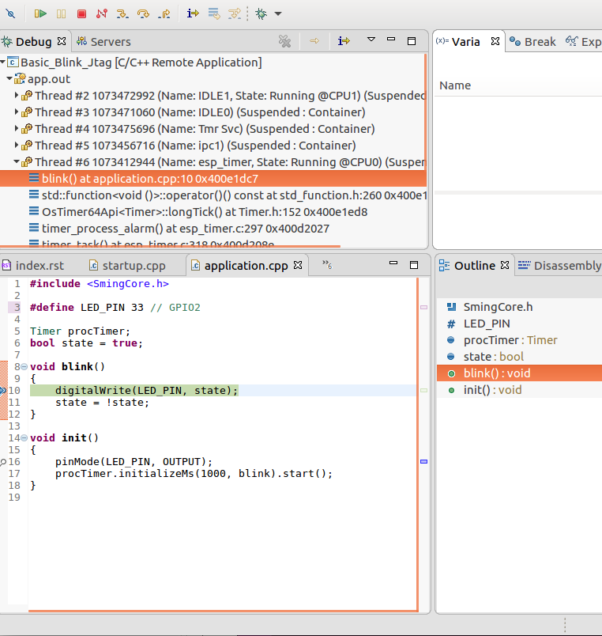

Debugging with Eclipse
----------------------

A good visualization helps us understand things faster.
What we can do is use :doc:`/tools/eclipse` and its debugging plugins to do remote debugging as we did from the command line.

.. note::

   For all architectures the :sample:`Basic_Blink` is recommended as a starting point, as it's the simplest.

   The :sample:`LiveDebug` sample demonstrates more advanced features and is more focused on the Esp8266.

Here is the general procedure for setting up Eclipse for debugging:

Start Eclipse CDT and import the sample makefile
   - Select *File* -> *New* -> *Project* -> *C/C++* -> *Makefile Project with Existing Code*
   - Point Eclipse to the location of the application sample
   - Import the Sming Framework

   .. figure:: debug-eclipse-1.png
      :alt: Import Project

      Import Project

Once the two projects are in Eclipse, set the *Basic_Blink* project to
reference the *Sming* project.

Host Emulator
   Create a new *Debugging* Configuration:

   - Select *Run* -> *Debug Configurations* -> *C/C++ Application*
   - Right-click and create a new *C/C++ Application*
   - In the *Main* tab set, set:
      - *Project*: *Basic_Build*
      - *C/C++ Application*: *out/Host/debug/firmware/app*
      - disable for now the *auto* build

   .. figure:: debug-host-2.png
      :alt: C/C++ Application

      C/C++ Application

   Then go to the Debugger tab and point the GDB debugger to your
   gdb binary. (Type ``make list-config`` and look for :envvar:`GDB`.)

   .. figure:: debug-host-3.png
      :alt: Debugger configuration

      Debugger configuration

Embedded Devices
   Create a new *Remote Debugging* Configuration:

   - Select *Run* -> *Debug Configurations* -> *C/C++ Remote Application*
   - Right-click and create a new *C/C++ Remote Application*
   - In the *Main* tab set the following, replacing ``{ARCH}`` with, for example, ``Esp8266``:
      - *Project*: *Basic_Build*
      - *C/C++ Application*: *out/build/{ARCH}/Debug/app.out*
      - disable for now the *auto* build

   .. figure:: debug-eclipse-2.png
      :alt: Remote Debugging Session

      Remote Debugging Session

   Now go to the Debugger tab and point the GDB debugger to your GDB binary.
   To find this, type ``make list-config | grep GDB`` at the command prompt and look for :envvar:`GDB`.

   .. figure:: debug-eclipse-3.png
      :alt: Remote Debugging Session

      Remote Debugging Session

   Make sure to load also the *GDB command file*. This is identified by :envvar:`GDBSTUB_DIR`.
   The file is called ``gdbcmds``, and you may wish to place
   a copy of the file somewhere else, especially if you intend to modify it.
   Here is the one for Esp8266: :source:`Sming/Arch/Esp8266/Components/gdbstub/gdbcmds`.

   Finally we should configure the remote connection via the *Debugger* -> *Connection* tab.
   This varies slightly between architectures:

   Esp8266
      - type: *Serial*
      - device: */dev/ttyUSB0* (or as required for your operating system)
      - speed: 115200

      .. figure:: debug-esp8266-4.png
         :alt: Set remote connection

         Set remote connection

   Esp32
      - type: *TCP*
      - host: localhost
      - port: 3333

      .. figure:: debug-esp32-4.png
         :alt: Set remote connection

         Set remote connection

We are now ready for debugging. Press the *Debug* button. (In the
screenshot above the Debug button is in the bottom-right corner.) After
some seconds your debugging session should be up and running and you can
enjoy live debugging.

   Live Debugging Session (Esp8266)

   Live Debugging Session (Esp32)

You will be able to see the current variables and their values. You
should be able to go step by step, go inside of functions, add
breakpoints to code in RAM or add breakpoints to code that was in FLASH.
