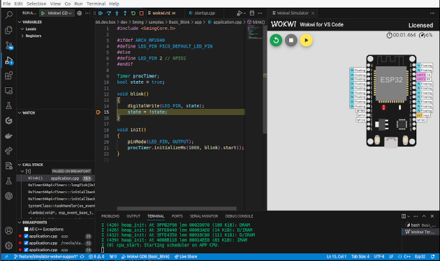

****************
Simulator: Wokwi
****************

.. highlight:: bash

* At the moment Sming and Wokwi have experimenta support for the Esp32 architecture. 
* Only VS Code IDE is supported
* The Esp32 simulator lacks certain features and may encounter failures; hence, it is recommended for use with simple applications.

Wokwi Support into VS Code
==========================

To integrate Wokwi support into your VS Code, run the following command from your application's root directory::

    make ide-vscode ENABLE_WOKWI=1 SMING_ARCH=Esp32

Install the recommended extensions
----------------------------------

Ensure that you have installed the newly recommended extensions. If none appear, manually install the ``wokwi.wokwi-vscode`` extension.

Merge all partitions to a single flash file
-------------------------------------------

From the root directory of your application, run the following command to consolidate all partitions for the simulator and flash them into a single file::

    make mergeflash SMING_ARCH=Esp32

Usage
=====

Basic_Blink
-----------

The Basic_Blink sample can be compiled and executed directly on a simulator before deploying it to a physical microcontroller. 
Follow the commands below to get started::

    cd $SMING_ARCH/../samples/Basic_Blink
    make ide-vscode ENABLE_WOKWI=1 SMING_ARCH=Esp32
    make mergedflash

Once the compilation is complete, open the folder in VS Code, install the recommended extensions, and either open the ``diagram.json`` file or press F1 and type ``Wokwi``.
From the options, choose to start the Wokwi simulator.

Debugging
=========

Running the Basic_Blink sample in the simulator enables you to debug it directly in VS Code. 
Set a breakpoint in the ``init`` function in the Basic_Blink ``app/application.cpp`` file. 
Press F1 and select "Start Simulator and Wait for Debugger." In the Launch configurations, choose "Wokwi GDB" and click the play button. 
This initiates a new debugging session, allowing you to debug the code running in the simulator.

Diagram Editor
==============

The ``diagram.json`` file, which includes elements and their connections, can be edited on the `Wokwi official website <https://wokwi.com/>`__. 
You can add new elements such as extra LEDs or servos. Ensure to copy the modified contents of the diagram.json from the website to your local environment.
