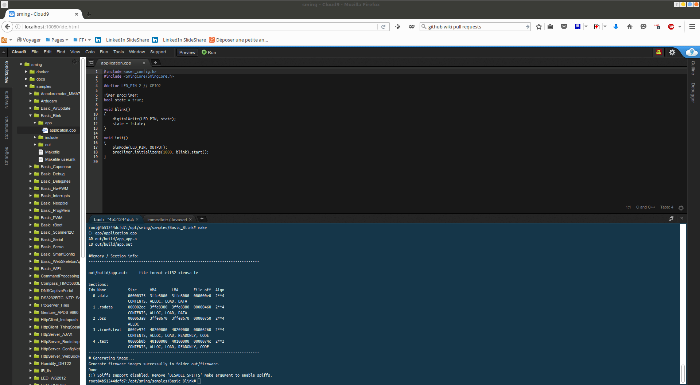

******
Docker
******

Docker is a useful tool if you want to experiment with Sming in an isolated environment.

If you're unfamiliar with Docker, you can find a good overview in the article,
`What is a Container? <https://www.docker.com/resources/what-container>`__.

This page shows how to create docker containers with all the necessary tools to
build Sming applications.

Install Docker
==============

Visit the official
`Docker Installation Page <https://docs.docker.com/engine/installation/>`__
and follow the instructions tailored for your operating system.

Install docker-compose
======================

Docker Compose makes dealing with the orchestration processes of Docker
containers (such as starting up, shutting down, and setting up
intra-container linking and volumes) really easy.

With *docker compose* we can define the entire multi-container application
in a single file and spin it up using one command.

Visit the official
`Docker Compose Installation Page <https://docs.docker.com/compose/install/>`__
and follow the instructions tailored for your operating system.

Building images
===============

You can find the related Docker scripts in ``$SMING_HOME/Tools/Docker``.

To build your own images, do this::

   cd $SMING_HOME/Tools/Docker/cli
   docker-compose build
   cd $SMING_HOME/Tools/Docker/ide
   docker-compose build

Adjust your settings
====================

::

   sming-ide:

     build: .

     volumes:
       - ../../Sming/:/opt/sming/

    ports:
    #choose a free port to connect to the web C9 editor
    - "10080:80"

    devices:
      # uncomment to map your serial USB adaptor 
      #- "/dev/ttyUSB0:/dev/ttyUSB0"

    privileged: true

Start your container
====================

.. code-block:: bash

   cd /opt/sming/Tools/Docker/ide && docker-compose up -d

Open your browser
=================

``http://localhost:10080``

.. code-block:: bash

   cd /opt/sming/samples/Basic_Blink
   make
   make flash

