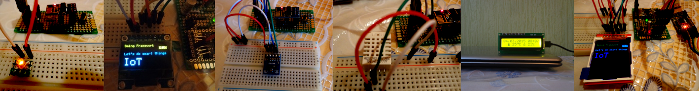

Welcome to Sming Framework
================================

.. highlight:: c++

**Let's do smart things!!!**

Sming is an asynchronous C/C++ framework with superb performance and multiple network features.
Sming is open source and is tailored towards embedded devices.
It supports multiple architectures as ESP8266 for example.

|samples|_

.. _samples: samples.html

Summary
-------
-  Superb performance and memory usage (Sming compiles to native firmware!)
-  Fast and user friendly development
-  Simple yet powerful hardware API wrappers
-  Compatible with standard :doc:`libraries` - use any popular hardware in few lines of code
-  Built-in file system: :component:`spiffs`
-  Built-in powerful wireless modules
-  Powerful asynchronous (async) network stack.

  -  Async TCP and UDP stack based on `LWIP <http://savannah.nongnu.org/projects/lwip/>`__
  -  With clients supporting: HTTP, MQTT, WebSockets and SMTP
  -  And servers for: DNS, FTP, HTTP(+ WebSockets), Telnet
  -  With SSL support for all network clients and servers based on `axTLS 2.1+ <https://github.com/igrr/axtls-8266>`__ with `Lwirax <https://github.com/attachix/lwirax/>`__.
  -  Out of the box support for OTA over HTTPS.

-  ESP8266 specific features

  -  Integrated boot loader :component:`rboot` with support for 1MB ROMs, OTA firmware updating and ROM switching
  -  :doc:`Crash handlers <information/debugging>` for analyzing/handling system restarts due to fatal errors or WDT resets.
  -  :component-esp8266:`PWM support <pwm_open>` based on `Stefan Bruens PWM <https://github.com/StefanBruens/ESP8266_new_pwm.git>`__
  -  Optional :component-esp8266:`custom heap allocation <custom_heap>` based on `Umm Malloc <https://github.com/rhempel/umm_malloc.git>`__
  -  Based on :component-esp8266:`Espressif NONOS SDK <esp8266>`. Tested with versions 1.5, 2.0 and 3.0.

-  Linux/Windows features

  -  Sming has a :doc:`host emulator <arch/host/host-emulator>` that allows libraries and sample applications to be compiled on a Linux/Windows host system
     and be tested before uploading them to an actual microcontroller.

.. toctree::
   :caption: Contents:
   :hidden:

   getting-started
   features
   samples
   libraries
   api/index
   information/index
   upgrading/index
   experimental/index
   contribute/index
   tools/index
   troubleshooting/index
   about

Indices and tables
------------------

* :ref:`genindex`
