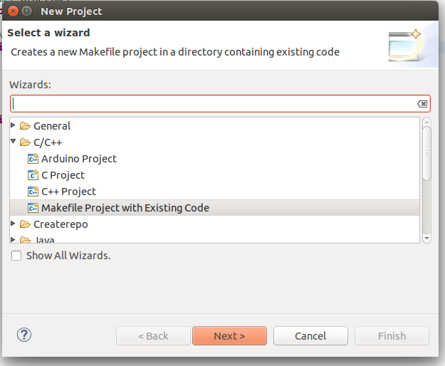
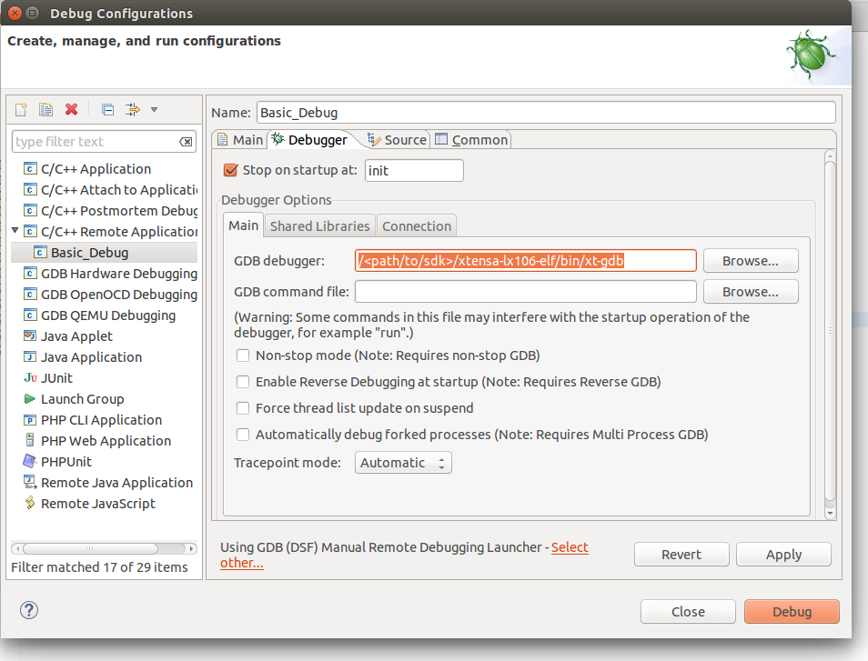

*********
Debugging
*********

Debugging is a powerful technique allowing you to interactively run your
code and be able to see much more information about the things that went
wrong.

Recompilation is required
=========================

In order to debug applications based on Sming Framework make sure that
you are using Sming version 3.8.0 or newer.

Library
-------

If you want to debug inside of the Sming Framework library make sure to
(re)compile it with :envvar:`ENABLE_GDB` =1 directive::

   cd $SMING_HOME
   make dist-clean
   make ENABLE_GDB=1 

The commands above will re-compile Sming with debug symbols and
optimizations for debugging. These commands need to be executed once.

Application
-----------

To use, (re)compile your application with the ENABLE_GDB option and
flash it to the board. For this example we will use the :sample:`LiveDebug`
sample application::

   cd $SMING_HOME/../samples/LiveDebug
   make clean
   make ENABLE_GDB=1 # -- recompiles your application with debugging support
   make flashapp # flashes ONLY the (re)compiled application

The application will start running on your device and will wait for a
debugger to pause its execution. To connect a debugger to the remote
application use the provided command::

   make gdb

This will start a new debugging session where you can run your code
interactively. Once the debugger is connect it will pause the execution
and you will be able to take control::

   Remote debugging using /dev/ttyUSB0
   gdbstub_init () at /home/slavey/dev/esp8266.dev.box/dev/Sming/Sming//gdb/gdbstub.cpp:914
   914         gdb_do_break();
   (gdb) 

GDB commands
============

There are multiple commands supported in GDB and we will mention only
some of them.

List current source code
------------------------

One possibility is to see the source code of the current line where the
execution has stopped. To achieve this you should type ``list`` in the gdb
console::

   (gdb) list
   909     SD(GDBSTUB_ENABLE_HOSTIO);
   910 #undef SD
   911 
   912 #if GDBSTUB_BREAK_ON_INIT
   913     if(gdb_state.enabled) {
   914         gdb_do_break();
   915     }
   916 #endif
   917 }
   918 

Break the execution
-------------------

This command will pause the debugger once it reaches a specific function
or line in the code. This is called ``breakpoint`` and can be set like this::

   (gdb) break blink
   Breakpoint 1 at 0x40105d4c: file app/application.cpp, line 66.

Notice: ``break`` sets a software breakpoint. This means that the
``blink`` function must be in IRAM. Otherwise the execution will fail.
If you take a look at :source:`samples/LiveDebug/app/application.cpp#L663`,
you will see a in the definition of the ``init`` function the following
attribute ``GDB_IRAM_ATTR``::

   void GDB_IRAM_ATTR init()

This attribute is used to put the ``init`` function in IRAM when the
code is compiled with the ``ENABLE_GDB=1`` directive.

Continue the execution
----------------------

To continue the execution of the application we can use the ``continue``
command::

   (gdb) continue
   Continuing.
   LiveDebug sample
   Explore some capabilities of the GDB debugger.

   [OS] mode : sta..
   ...
   [OS] cnt 

   Breakpoint 1, blink () at app/application.cpp:66
   66 {
   (gdb)   

Because we have set already a breakpoint for the ``blink`` function the
execution will be paused when the ``blink`` function is reached and from
here you can go to the next line or see the current values of the
variables.

Go to the next line
-------------------

This can be done using ``next``::

   (gdb) next
   67      digitalWrite(LED_PIN, ledState);

See variable value
------------------

The command to see a value is ``print`` followed by the name of the
value. For example to see the value of the ``ledState`` variable inside
the ``blink`` function we could type::

   (gdb) print ledState
   $1 = true

You can see more useful commands :ref:`here <useful-gdb-commands>`.

Or watch the following short video

.. image:: https://img.youtube.com/vi/hVwSX_7Ey8c/3.jpg
   :target: https://www.youtube.com/watch?v=hVwSX_7Ey8c

Debugging with visual debuggers like Eclipse CDT
================================================

A good visualization helps us understand things faster. What we can do
is use `Eclipse CDT <https://eclipse.org/cdt/downloads.php>`__ and its
debugging plugins to do remote debugging as we did from the command
line.

Here is how this can be done:

- Start Eclipse CDT and import the :sample:`LiveDebug` sample:

  - Select *File* -> *New* -> *Project* -> *C/C++* -> *Makefile Project with Existing Code*
  - Point Eclipse to the location of the LiveDebug sample
  - Import the Sming Framework (if you haven’t done it yet)

   Import Project

Once the two projects are in Eclipse, set the *LiveDebug* project to
reference the *Sming* project.

Now create a new *Remote Debugging* Configuration:

- Select *Run* -> *Debug Configurations* -> *C/C++ Remote Application*
- Right-click and create a new *C/C++ Remote Application*
- In the *Main* tab set, set:

  - *Project*: *Basic_Build*
  - *C/C++ Application*: *out/build/Esp8266/Debug/app.out*
  - disable for now the *auto* build

.. figure:: debugging-2.png
   :alt: Remote Debugging Session

   Remote Debugging Session

Then go to the Debugger tab and point the GDB debugger to your
Xtensa-gdb binary. (Type ``make list-config`` and look for :envvar:`GDB`.)

   Remote Debugging Session

Make sure to load also *GDB command file*. To find out its location, run ``make list-config``
and look for :envvar:`GDBSTUB_DIR`. The file is called ``gdbcmds``, and you may wish to place
a copy of the file somewhere else, especially if you intend to modify it.
You can see the file here :source:`Sming/Arch/Esp8266/Components/gdbstub/gdbcmds`.

Finally we should configure the remote connection. Go to the
*Debugger* -> *Connection* tab and set:

- type: *Serial*
- device: */dev/ttyUSB0* (or as required for your operating system)
- speed: 115200

   Set remote connection

We are now ready for debugging. Press the *Debug* button. (In the
screenshot above the Debug button is in the bottom-right corner.) After
some seconds your debugging session should be up and running and you can
enjoy live debugging.

.. figure:: eclipse-debug-session.png
   :alt: Live Debugging Session

   Live Debugging Session

You will be able to see the current variables and their values. You
should be able to go step by step, go inside of functions, add
breakpoints to code in RAM or add breakpoints to code that was in FLASH,
after it was executed executed at least once.

Enjoy!
