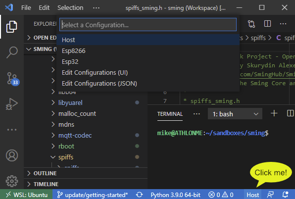
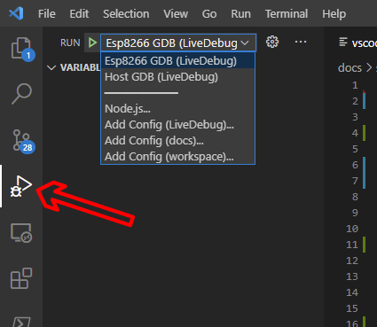

Using with MS Visual Studio Code
================================

.. highlight:: bash

Microsoft `Visual Studio Code <https://code.visualstudio.com/>`__ is a free (as in
"free beer") and Open Source code editor for Windows, Linux and Mac.

Software involved
-----------------

-  `Visual Studio Code <https://code.visualstudio.com/>`__
-  `C/C++ extension <https://marketplace.visualstudio.com/items?itemName=ms-vscode.cpptools>`__

.. note::

   Linux users may prefer `VSCodium <https://vscodium.com/>`__ which does not contain telemetry or tracking.

   Standard C/C++ language support is available via the `cpptools <https://github.com/microsoft/vscode-cpptools>`__
   extension which is not available in the vscodium repositories.

   Visit https://marketplace.visualstudio.com/items?itemName=ms-vscode.cpptools and go to ``Version History``
   to download the .vsix file. Open the ``Extensions`` pane in vscodium and drag the file there to install,
   or run ``codium --install-extension NAME-OF-FILE.vsix``.

Installation
------------

-  Install VS Code, extensions and tools
-  Navigate to project folder and create configuration as described below
-  Open workspace. If vscode is in your system path you can do this::

      code .

Configuration
-------------

Please make sure you have critical environment variables set globally **before** starting vscode.
See :doc:`/getting-started/config` for details.

One of the strengths of vscode is the use of well-documented configuration files.
You can find comprehensive documentation for these online.

However, setting these up is time-consuming so the build system can create them for you.
The vscode workspace root directory is your project directory.

Change to your project directory (e.g. ``samples/Basic_Blink``) and run these commands::

   make ide-vscode SMING_ARCH=Esp8266
   make ide-vscode SMING_ARCH=Host

Now open the workspace in vscode, and open a source file (.c, .cpp, .h).
You should now be able to select the architecture from the icon in the bottom-right corner:

   VS Code language selection

A selection of tasks are provided which you can view via ``Terminal`` -> ``Run Task``.

To debug your application, follow these steps:

-  Select the appropriate architecture (e.g. Host, Esp8266)
-  Select ``Terminal`` -> ``Run Task`` -> ``Full rebuild (with debugging)``
-  Confirm that the baud rate (:envvar:`COM_SPEED_GDB`) and port (:envvar:`COM_PORT_GDB`) are
   set correctly::

      make gdb SMING_ARCH=Esp8266 COM_PORT_GDB=/dev/ttyUSB0 COM_SPEED_GDB=115200

-  Update the vscode configuration::

      make ide-vscode

-  In vscode, select the require 'Run' task:

   VS Code debug selection

Editor window titles
--------------------

As Sming is a multi-architecture framework there are lots of files with the same name.
By default editor window titles contain only the filename, but in vscode this can be changed
to something more useful, like including the parent directory name.

Open user settings JSON (via F1 hotkey) and add this to the config:

.. code-block:: json

    "workbench.editor.customLabels.patterns": {
        "**/*.*": "${dirname}/${filename}.${extname}"
    }

Manual configuration changes
----------------------------

When you run ``make ide-vscode`` the configuration files are actually generated using a python script
``Tools/vscode/setup.py``. Configuration variables are passed from the project makefile.

If you make any changes to the configuration files, please note the following behaviour:

-  The ``Host``, ``Esp32`` or ``Esp8266`` intellisense settings will be overwritten.
-  The ``Esp8266 GDB`` and ``Host GDB`` launch configurations will be overwritten
-  The ``sming.code-workspace`` and ``.vscode/tasks.json`` files will be created if they do not already exist.
   To re-create these they must first be deleted.

Ideally the vscode configuration files should not need to be kept under configuration control,
but generated when required.

Some settings are necessarily configured via the ``setup.py`` script, however most settings can
be changed by editing the files in ``Tools/vscode/template``.

If you do this, remember to keep a copy as they'll be overwritten otherwise.

And, please consider contributing any changes or suggestions to the community!

Known issues / features
-----------------------

-  The vscode configuration files are only updated when you manually run ``make ide-vscode``.
   If you change critical configuration variables or add/remove Components to your project,
   you may need to run it again to update them.
-  When running ``make ide-vscode``, comments in the configuration files will be discarded.
-  ``make ide-vscode`` may overwrite parts of your configuration: be warned!
-  When debugging for esp8266 output in the console is not formatted correctly.
   Lines appear with @ in front of them.
-  You may find vscode uses powershell instead of cmd.exe to execute tasks.
   Sming should work OK with either, but you can change this in the `sming.code-workspace` file
   via the ``terminal.integrated.defaultProfile.windows`` setting.
