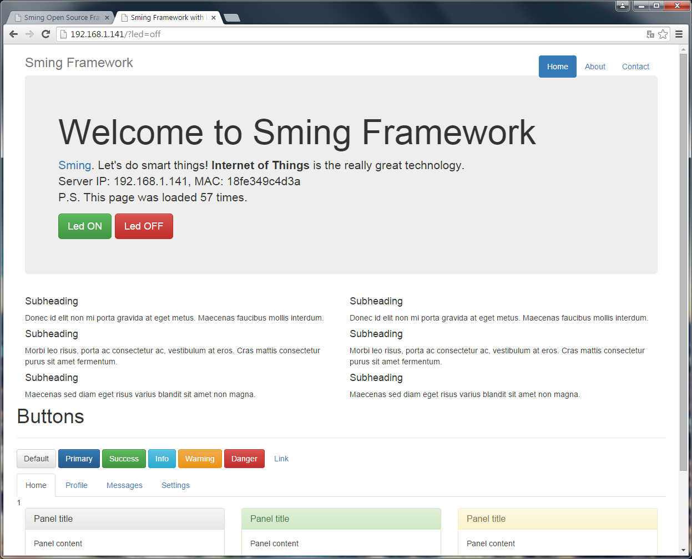

Bootstrap Http Server
=====================

ESP8266 embedded web server.

At start ESP will download all requried files from remote server. All
content, including JQuery and Bootstrap will be saved on device (and
can work offline). Static files stored in GZIPed mode.

