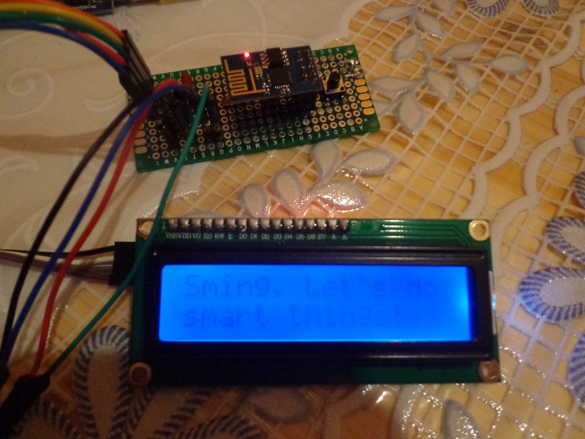

Liquid Crystal 44780
====================

Introduction
------------

Example code for I2C LiquidCrystal LCDs.

This code uses the following GPIO:

-  GPIO0 SCL
-  GPIO2 SDA

Build instructions
------------------

Use ``make`` and ``make flash`` to build and flash the firmware to the
ESP8266 board.
