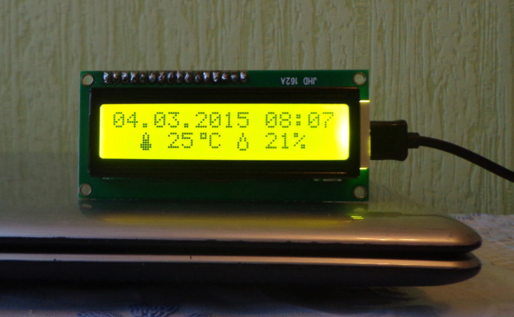
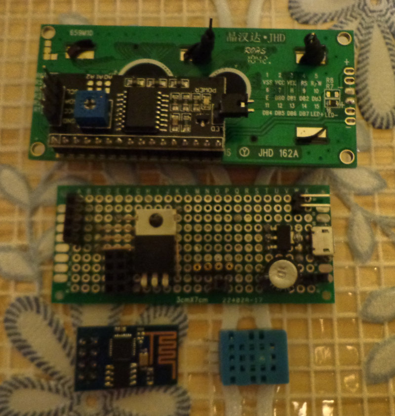
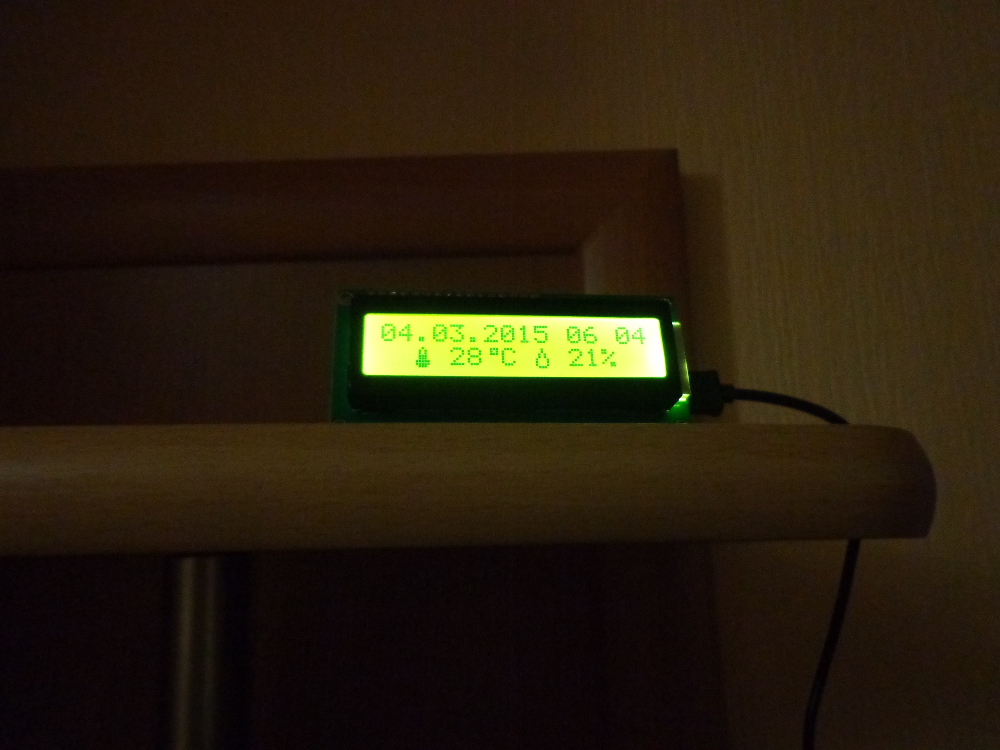
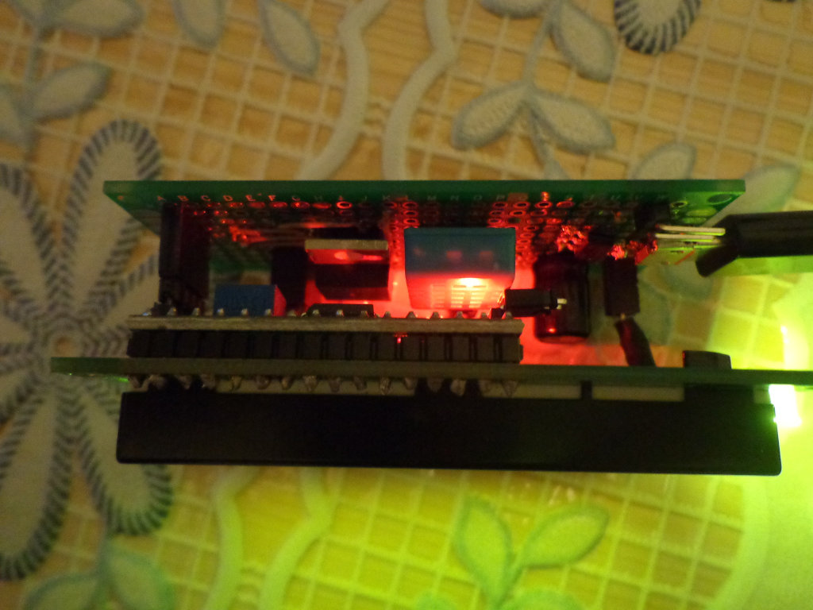
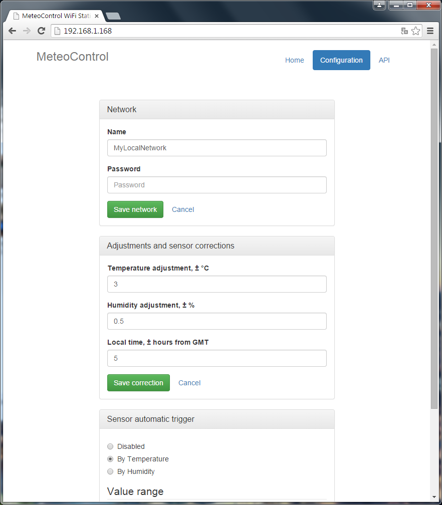

MeteoControl
============

More complex example of Internet of Things device. Can read humidity and
temperature data from sensor and output it to screen with actual time.
Time loaded directly from Google. Also with device can automatically
control any external load.

**Features:**

* temperature
* humidity
* actual time from internet
* built-in display
* web control interface
* automatically control external load
* HTTP API for data reading & writing
* initialization from internet at first run

**How web interface looks like:**

