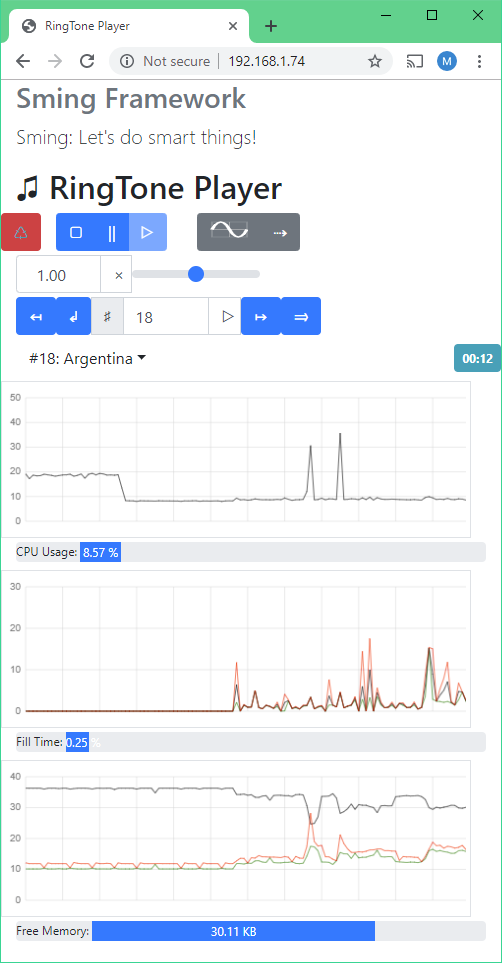

RingTone Player
===============

Introduction
------------

You may find the need to include basic audio features such as haptic feedback
or tune generation to support an existing application. The advantage of using I2S
for this is the very low CPU overhead.

This sample demonstrates how simple audio can be added to an application using the
I2S ToneGenerator and RingTone libraries. The sample contains a selection of tunes.

The sample may be controlled via serial terminal, or by web interface.

Serial connection
-----------------

Because I2S uses the serial RX pin, the serial port uses the alternate pin mappings.
See :library:`ToneGenerator` for connection details.

You'll still need the regular serial port for programming. Here's a sample setup for Windows:

- Using NodeMCU with standard serial port connected to COM4
- Second USB/UART converter connected to alternate serial pins as COM8

The command line to build, flash and open a terminal would be:

.. code-block:: batch

   make -j COM_PORT=COM8 COM_SPEED=115200 COM_PORT_ESPTOOL=COM4 COM_SPEED_ESPTOOL=921600 SPI_MODE=dio SPI_SIZE=4M
   make flashinit
   make flash

Web interface
-------------

This is built using `Bootstrap 4.3.1 <https://getbootstrap.com/docs/4.3/>`__ and `jQuery 3.4.1 <https://api.jquery.com/>`__.

|img-reboot| Reboot
   Un-installs the I2S driver then restarts the system after 5-seconds.
   The memory consumption drops as the DMA buffers are de-allocated.

|img-play| Play controls
   |stop| Stop
      Tune playback stops at the current position, and the I2S driver is stopped
      so I2S interrupts are disabled. DMA buffers remain allocated.

   |pause| Pause
      Tune playback stops at the current position, but I2S interrupts remain active.

   |play| Play
      Resumes tune playback from stop/pause states.

|img-mode| Voice and Mode
   Selects available voice for the tone generator (Sine, Triangular, Sawtooth or Square wave).
   
   Playback mode

   - |seq| Sequential
   - |random| Random

Playback speed
~~~~~~~~~~~~~~

|img-speed|

Tune selection
~~~~~~~~~~~~~~

|img-select|
   |prev| Previous
      Play previous tune
   |rewind| Rewind
      Rewind to start of current tune
   |next| Next
      Play next tune
   |skip| Skip
      Skip to a random tune

|img-current|
   Shows the current tune and elapsed play time. A drop-down list shows all available tunes.

.. |reboot| unicode:: 9850

.. |stop| unicode:: 9634
.. |pause| replace:: ||
.. |play| unicode:: 9655

.. |random| unicode:: 128256
.. |seq| unicode:: 8674

.. |prev| unicode:: 8612
.. |rewind| unicode:: 8626
.. |next| unicode:: 8614
.. |skip| unicode:: 8594

Graphs
~~~~~~

In addition to play controls, there are three graphs showing some statistics over a two-minute period.
The data is sent from the ESP8266 via websocket once per second.

CPU Usage
   .. image:: ringtone-cpu.png
      :alt: CPU Usage graph

   Gives an indication of processor loading. Try connecting a second web client to see what happens.

Fill Time
   .. image:: ringtone-fill.png
      :alt: Fill time graph

   Shows the time taken by the :library:`ToneGenerator` to create and buffer tone waveforms.

   This graph has three traces, indicating time in milliseconds over the 1-second update period:
   
   - Red: Longest time taken
   - Green: Shortest time
   - Black: Average time
   
   You'll see more activity during complex, fast tunes but also for lower notes which require more
   samples (and larger buffers).
   
   The progress bar indicates the total time taken over the update period.

Memory Usage
   .. image:: ringtone-mem.png
      :alt: Memory usage graph
   
   The graph has three traces:
   
   - Black: Available memory
   - Red: Maximum memory used during the update period
   - Green: Memory in use at the time of update
   
   The red/green traces generally follow each other and represent the allocation/deallocation of
   tone buffers.
